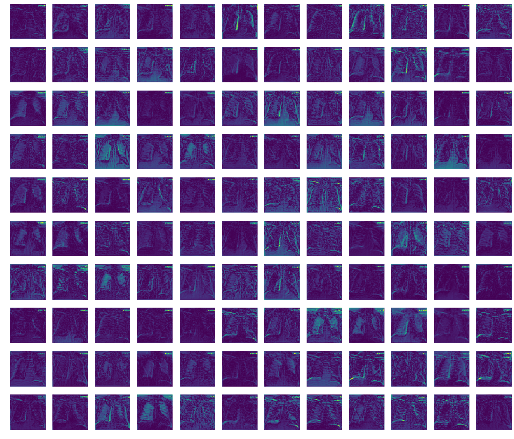
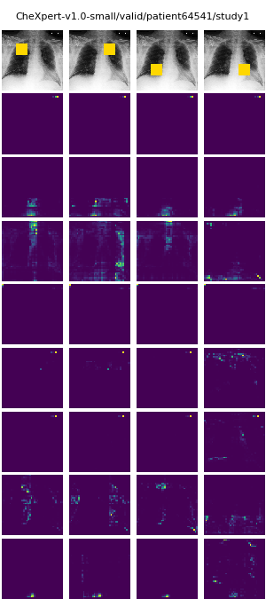

# GENIUS_CheXpert

Implementation of classification models on the [CheXpert dataset](https://stanfordmlgroup.github.io/competitions/chexpert/) 

### Dependencies
* python 3.5+
* pytorch 1.0+
* torchvision
* numpy
* pandas
* sklearn
* matplotlib
* tensorboardX
* tqdm

### Usage

To train a model using default batch size, learning:
```

--- python chexpert.py --train --cuda 0 --n_epochs 5 --plot_roc --batch_size 24 --model densenet121 --output_dir densenet121-E5 >> output_densenet121-E5.txt

python chexpert.py  --train
                    --data_path         # location of dataset
                    --model             # choice of densenet121 or resnet152 or efficientnet-b[0-7]
                    --pretrained        # flag if pretrained model should be downloaded (only for densenet and resnet)
                    --cuda              # number of cuda device to train on
```

To evaluate a single model:
```
python chexpert.py  --evaluate_single_model / evaluate_ensemble
                    --model             # architecture of the saved model
                    --data_path         # location of dataset
                    --output_dir        # folder where experiment results and tensorboard tracking are saved
                    --restore           # if evaluate_single_model - file path to the saved model checkpoint,
                                          if evaluate_ensemble - folder path to the directory where checkpoints are saved
                    --plot_roc          # flag whether to also plot ROC and PR curves
```

To visualize class activation mappings from the validation set. Saves a grid of model probabilities, original image, and grad-cam visualization for 3 examples for each condition singularly present, 2 present conditions, >2 present conditions, and no present conditions; example below. Additionally for the same images, if attention model, saves a visualization of attention probabilities at each attention layer, example below.
```
python chexpert.py  --visualize
                    --model             # choice of densenet121 or resnet152 of the saved model
                    --data_path         # location of dataset
                    --output_dir        # folder where experiment results are saved
                    --restore           # file path to the saved model checkpoint
```


###### DenseNet121 features at Transition1 layer


###### DenseNet121_attn_aug attention maps at Transition1 layer

